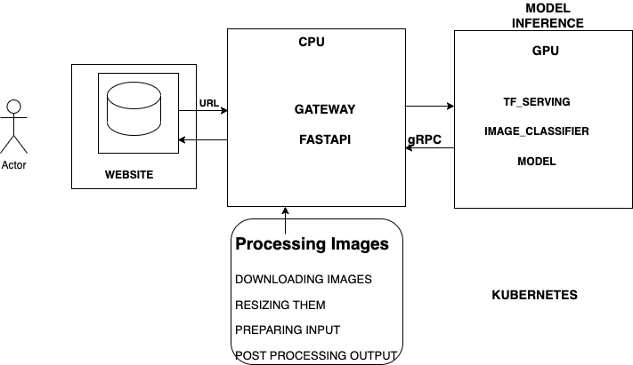

# Tensorflow Serving



I use TensorFlow Serving and deploy it on the Kubernates. TF-Serving library is written in C++ and it focuses only on inference, it takes preprocessed input and output the prediction.

**Tensorflow-serving** makes use of [**gRPC**](https://grpc.io/), a framework for connecting services in and across datacenters. gRPC uses Protocol Buffers (AKA Protobuf) for formatting data, a kind of binary encoding which is faster and more efficient than JSON.

## Running everything locally with docker-compose

Now I will create our model service and gateway, it's time to dockerize them and run both the model and gateway concurrently locally.

### Preparing the images

### Model image
Build the model image with the following command. Reference the `image.model.dockerfile` file for more details

```
docker build -t image-classifier-model:v1 -f image-model.dockerfile .
```

### Gateway image
The dockerfile for the gateway will have to include the dependency management files, the gateway script (as well as the proto.py script if you have one) and will have to define an entrypoint using a WSGI HTTP server such as `uvicorn`. See the `image.gateway.dockerfile` for more details.

Build the dockerfile with the command below.
```
docker build -t image-classifier-gateway:v1 -f image-gateway.dockerfile .
```

### Running and testing the final app locally with docker-compose
Running the model and gateway containers in detached mode
```
docker-compose up -d
```

Run the python script `test.py` to test the gateway service
```
python test.py
```

Gives an example output as below
```python
{'category': 'plate'}
```

Or browse with the url `http://localhost:9696/docs` and test out the predict endpoint


## Deploying TensorFlow models to Kubernetes
We will deploy a our model and gateway app services with Kubernetes. We will need 2 additional tools:

- [Minikube](https://minikube.sigs.k8s.io/docs/start/)/[Kind](https://kind.sigs.k8s.io/docs/user/quick-start/) (Kubernetes in Docker): this tool allows you to create a local Kubernetes cluster in your local computer. I will use minikube for this project
- kubectl (pronounced coob-control): the Kubernetes command-line tool, used to run commands against Kubernetes clusters.

### Installing kubectl
`kubectl` is the Kubernetes command-line tool used to run commands against Kubernetes clusters.

Installation instructions for all major platforms are available in the [official Kubernetes website](https://kubernetes.io/docs/tasks/tools/).

> Note: Docker Desktop for both Windows and MacOS already includes `kubectl`.

The goal  to deploy our app to EKS, AWS' Kubernetes service. AWS also distributes `kubectl`; installation instructions from AWS [can be found here](https://docs.aws.amazon.com/eks/latest/userguide/install-kubectl.html). According to the EKS website, the Amazon distributed `kubectl` binaries are identical to the official ones.

## Setting up a local Kubernetes cluster with Minikube
Minikube is a tool that will allow us to create a local Kubernetes cluster in our computer for learning and developing.

Installation instructions are available on the [official website](https://minikube.sigs.k8s.io/docs/start/).

Once `Minikube` is installed, create a cluster with the following command (it may take a few minutes):

```
minikube start --driver=docker
```

Note: you may delete a cluster with `minikube delete`

Once the cluster is created, in order to access it with `kubectl` we can get the cluster info to it. You may do so with the following command:

```
kubectl cluster-info
```

## Deploying the Model and Gateway
Deployments in Kubernetes are defined with YAML files. See the [kube-local-config directory](./kube-local-config/) for both model and gateway deployments and service configurations

### Model and Gateway deployments
Before we run the deployment, we need to load our images into our cluster nodes.

```sh
minikube image load image-classifier-model:v1
minikube image load image-classifier-gateway:v1
```

We can now apply our deployments file to our cluster:

```sh
kubectl apply -f model-deployment.yaml
kubectl apply -f gateway-deployment.yaml
```

> Note: you can check the status of your cluster by using the `kubectl get deployment` and `kubectl get pod` commands. In case of errors, you can get additional info from pods by using the `kubectl describe pod pod-name-taken-from-get-pod | less` command.

> Note 2: you can remove a deployment with `kubectl delete -f deployment_name.yaml`

### Model and Gateway deployment services
We can also apply our service files to our cluster

```sh
kubectl apply -f model-service.yaml
kubectl apply -f gateway-service.yaml
```

And finally test it with port forwarding and the test script (check the port that you're accessing in the script!):

```
kubectl port-forward service/gateway 9696:80
```

### Now run the test script to test the gateway service

```
python test.py
```

Gives an example output as below
```python
{'category': 'plate'}
```

Or browse with the url `http://localhost:9696/docs` and test out the predict endpoint


## Deploying to EKS
[**EKS**](https://aws.amazon.com/eks/) is AWS' Kubernetes service. I describe below the steps how to deploy our app to [EKS](https://aws.amazon.com/eks/).

### Creating a cluster on EKS
We can use the AWS website or aws-cli to create a cluster, but we will use instead [`eksctl`](https://eksctl.io/).

[`eksctl`](https://eksctl.io/) is a CLI tool for creating and managing clusters on EKS. You may learn more about it on its [official website](https://eksctl.io/). You can find download and install instructions on the [AWS EKS documentation pages](https://docs.aws.amazon.com/eks/latest/userguide/eksctl.html).

`eksctl` can create clusters with default values. If you want to customize your cluster, you will need to provide a YAML configuration file.

Here's an example [eks-config.yaml](./kube-aws-config/eks-config.yaml) file:

```
cd kube-aws-config
```

```
eksctl create cluster -f eks-config.yaml
```

If you encounter any issues, check CloudFormation console or try

```
 eksctl utils describe-stacks --region=us-east-1 --cluster=image-classifier-eks
```

In case you need to clean up resources

```
eksctl delete cluster --region=us-east-1 --name=image-classifier-eks
```

## Publishing the image to ECR
For EKS to work we need to provide the Docker images we will use for our deployments.

### Create ECR repository
```
aws ecr create-repository --repository-name image-classifier
```

```
{
    "repository": {
        "repositoryArn": "arn:aws:ecr:us-east-1:470656852239:repository/image-classifier",
        "registryId": "470656852239",
        "repositoryName": "image-classifier",
        "repositoryUri": "470656852239.dkr.ecr.us-east-1.amazonaws.com/image-classifier",
        "createdAt": "2022-12-06T15:42:25+03:00",
        "imageTagMutability": "MUTABLE",
        "imageScanningConfiguration": {
            "scanOnPush": false
        },
        "encryptionConfiguration": {
            "encryptionType": "AES256"
        }
    }
}
```

### Updating the deployment config files
We now need to modify both `model-deployment-yaml` and `gateway-deployment-yaml` so that the container specs point to the images hosted on ECR as seen in the [kube-aws-config](./kube-aws-config/) directory.

```
ACCOUNT_ID=470656852239
REGION=us-east-1
REPOSITORY_IMAGE=image-classifier
PREFIX=${ACCOUNT_ID}.dkr.ecr.${REGION}.amazonaws.com/${REPOSITORY_IMAGE}

GATEWAY_LOCAL=image-classifier-gateway:v1
GATEWAY_REMOTE=${PREFIX}:image-classifier-gateway-v1
docker tag ${GATEWAY_LOCAL} ${GATEWAY_REMOTE}

IMAGE_MODEL_LOCAL=image-classifier-model:v1
IMAGE_MODEL_REMOTE=${PREFIX}:image-classifier-model-v1
docker tag ${IMAGE_MODEL_LOCAL} ${IMAGE_MODEL_REMOTE}
```

### Login into ECR
```
$(aws ecr get-login --no-include-email)
```

```
aws ecr get-login-password \
    --region ${REGION} \
| docker login \
    --username AWS \
    --password-stdin ${ACCOUNT_ID}.dkr.ecr.${REGION}.amazonaws.com
```

```
Login Succeeded

Logging in with your password grants your terminal complete access to your account.
For better security, log in with a limited-privilege personal access token. Learn more at https://docs.docker.com/go/access-tokens/
```

### Push images to ECR
```
docker push ${IMAGE_MODEL_REMOTE}
docker push ${GATEWAY_REMOTE}
```

### Applying the deployments and services to EKS
Once `eksctl` finishes creating the cluster, kubectl should already be configured to work with it. You can test it with the following command:

```
kubectl get nodes
```

Once we've checked that kubectl displays the nodes (actually single node in this project) of our cluster, we can start applying and testing the deployments and services.

Let's begin with the model.

```
kubectl apply -f model-deployment.yaml
kubectl apply -f model-service.yaml
kubectl get pod # check if the pod is active
kubectl get service # check if service is working
```

start testing by doing port forwarding to test the service:

```
kubectl port-forward service/tf-serving-image-classifier-model 8500:8500
```

On another terminal, run the gateway script locally

```
python gateway.py
```

Let's now continue with the gateway.

```
kubectl apply -f gateway-deployment.yaml
kubectl apply -f gateway-service.yaml
kubectl get pod # check if the pod is active
kubectl get service # check if service is working
```

This time, the output of kubectl get service should show an external IP next to the gateway service.

Let's do port forwarding to test it:

```
kubectl port-forward service/gateway 8080:80
```

On another terminal, run the test script locally
```
python test.py
```

Finally, use the test script. Update the test script to point to the external URL of the gateway service.

> **WARNING**: The gateway is open to everyone who has the URL. AWS will charge you for machine uptime and requests received. Leaving it as it is may result in unwanted charges. There are ways to limit access to the gateway but it falls outside the scope of this project.

After you're done with the cluster, you may delete it to avoid additional charges.

```
eksctl delete cluster --name image-classifier-eks
```
