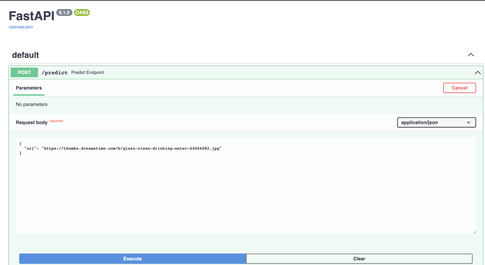

# Tensorflow Serving
I use TensorFlow Serving and deploy it on the Kubernates. TF-Serving library is written in C++ and it focuses only on inference, it takes preprocessed input and output the prediction.

**Tensorflow-serving** makes use of [**gRPC**](https://grpc.io/), a framework for connecting services in and across datacenters. gRPC uses Protocol Buffers (AKA Protobuf) for formatting data, a kind of binary encoding which is faster and more efficient than JSON.

## Running everything locally with docker-compose

Now I will create our model service and gateway, it's time to dockerize them and run both the model and gateway concurrently locally.

### Preparing the images

### Model image
Build the model image with the following command. Reference the `image.model.dockerfile` file for more details

```
docker build -t image-classifier-model:v1 -f image-model.dockerfile .
```

### Gateway image
The dockerfile for the gateway will have to include the dependency management files, the gateway script (as well as the proto.py script if you have one) and will have to define an entrypoint using a WSGI HTTP server such as `uvicorn`. See the `image.gateway.dockerfile` for more details.

Build the dockerfile with the command below.
```
docker build -t image-classifier-gateway:v1 -f image-gateway.dockerfile .
```

### Running and testing the final app locally with docker-compose
Running the model and gateway containers in detached mode
```
docker-compose up -d
```

Run the python script `test.py` to test the gateway service
```
python test.py
```

Gives an example output as below
```python
{'category': 'plate'}
```

Or browse with the url `http://localhost:9696/docs` and test out the predict endpoint




## Deploying TensorFlow models to Kubernetes
We will deploy a our model and gateway app services with Kubernetes. We will need 2 additional tools:

- [Minikube](https://minikube.sigs.k8s.io/docs/start/)/[Kind](https://kind.sigs.k8s.io/docs/user/quick-start/) (Kubernetes in Docker): this tool allows you to create a local Kubernetes cluster in your local computer. I will use minikube for this project
- kubectl (pronounced coob-control): the Kubernetes command-line tool, used to run commands against Kubernetes clusters.

### Installing kubectl
`kubectl` is the Kubernetes command-line tool used to run commands against Kubernetes clusters.

Installation instructions for all major platforms are available in the [official Kubernetes website](https://kubernetes.io/docs/tasks/tools/).

> Note: Docker Desktop for both Windows and MacOS already includes `kubectl`.

The goal  to deploy our app to EKS, AWS' Kubernetes service. AWS also distributes `kubectl`; installation instructions from AWS [can be found here](https://docs.aws.amazon.com/eks/latest/userguide/install-kubectl.html). According to the EKS website, the Amazon distributed `kubectl` binaries are identical to the official ones.

## Setting up a local Kubernetes cluster with Minikube
Minikube is a tool that will allow us to create a local Kubernetes cluster in our computer for learning and developing.

Installation instructions are available on the [official website](https://minikube.sigs.k8s.io/docs/start/).

Once `Minikube` is installed, create a cluster with the following command (it may take a few minutes):

```
minikube start --driver=docker
```

Note: you may delete a cluster with `minikube delete`

Once the cluster is created, in order to access it with `kubectl` we can get the cluster info to it. You may do so with the following command:

```
kubectl cluster-info
```

## Deploying the Model and Gateway
Deployments in Kubernetes are defined with YAML files. See the [kube-local-config directory](./kube-local-config/) for both model and gateway deployments and service configurations

### Model and Gateway deployments
Before we run the deployment, we need to load our images into our cluster nodes.

```sh
minikube image load image-classifier-model:v1
minikube image load image-classifier-gateway:v1
```

We can now apply our deployments file to our cluster:

```sh
kubectl apply -f model-deployment.yaml
kubectl apply -f gateway-deployment.yaml
```

> Note: you can check the status of your cluster by using the `kubectl get deployment` and `kubectl get pod` commands. In case of errors, you can get additional info from pods by using the `kubectl describe pod pod-name-taken-from-get-pod | less` command.

> Note 2: you can remove a deployment with `kubectl delete -f deployment_name.yaml`

### Model and Gateway deployment services
We can also apply our service files to our cluster

```sh
kubectl apply -f model-service.yaml
kubectl apply -f gateway-service.yaml
```

And finally test it with port forwarding and the test script (check the port that you're accessing in the script!):

```
kubectl port-forward service/gateway 9696:80
```

### Now run the test script to test the gateway service

```
python test.py
```

Gives an example output as below
```python
{'category': 'plate'}
```

Or browse with the url `http://localhost:9696/docs` and test out the predict endpoint


