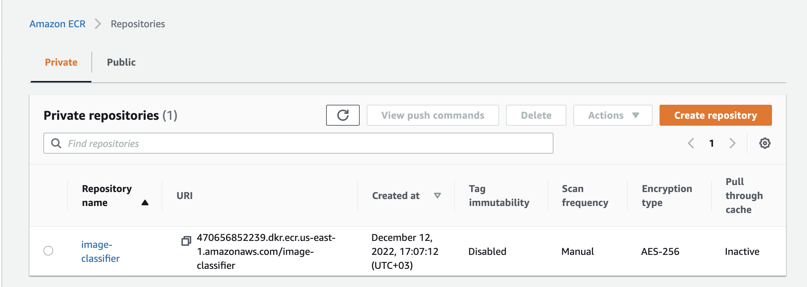
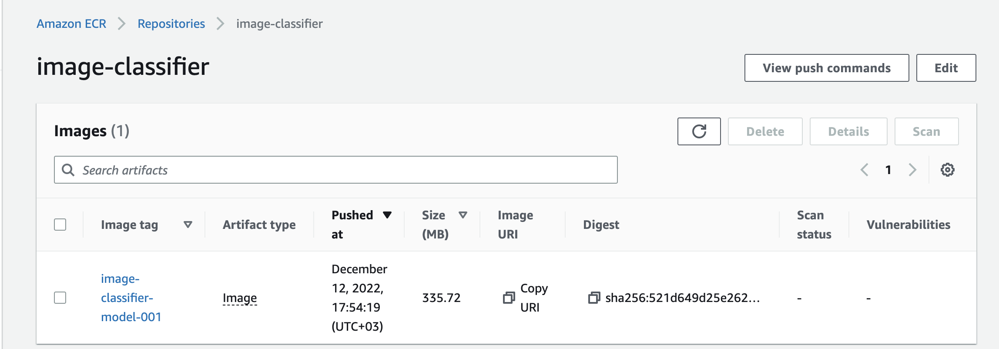
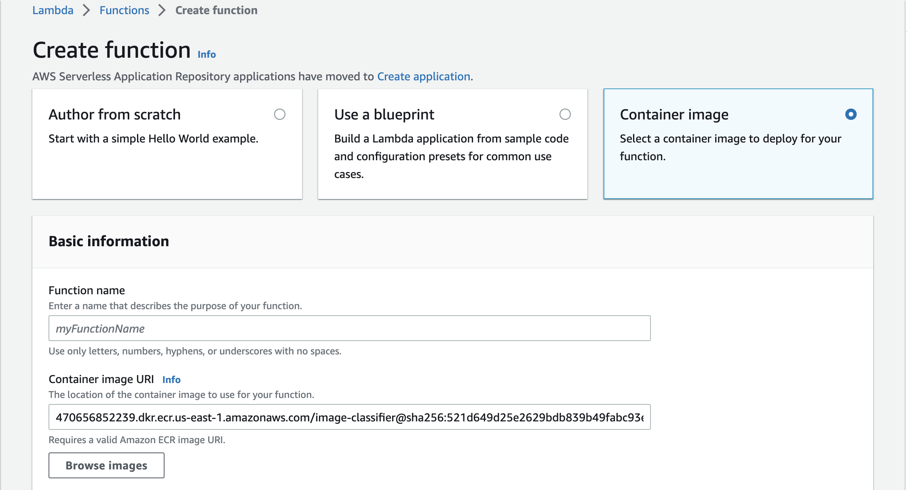
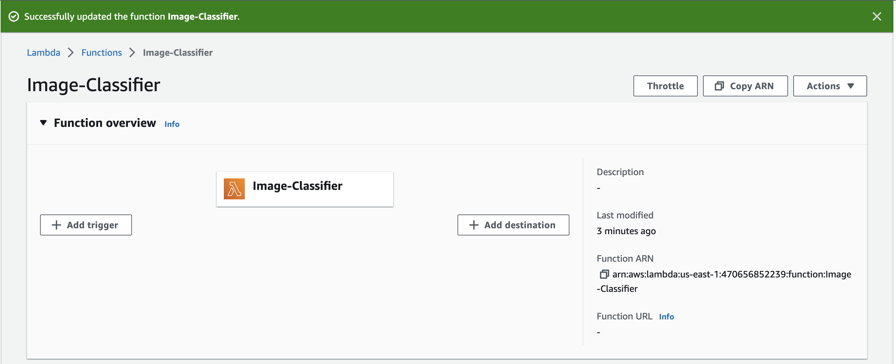
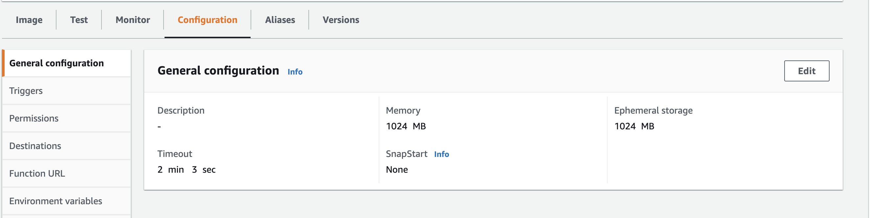
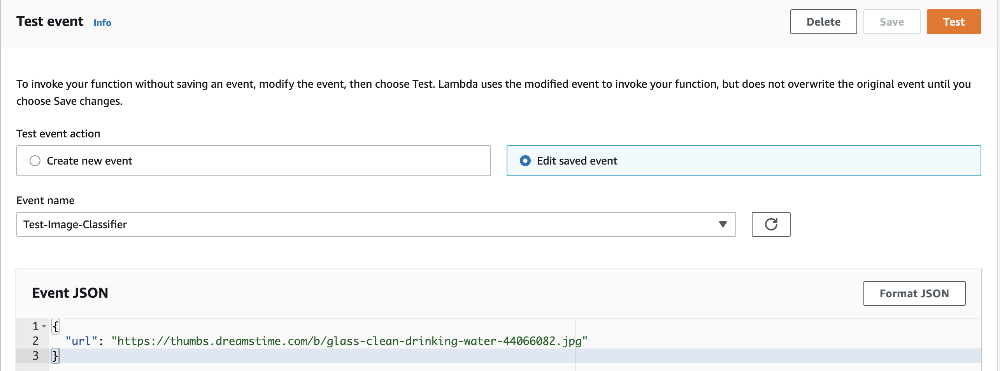
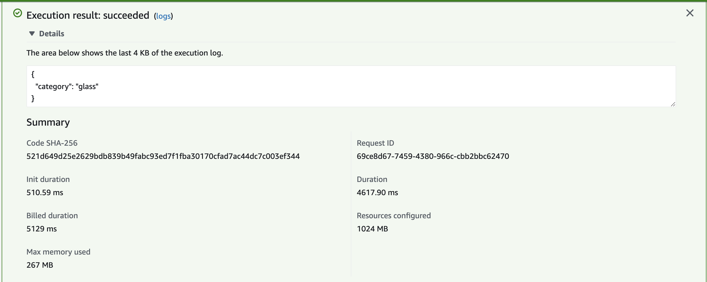

## Preparing a Docker image
We can use a publicly available Lambda Python base image from Amazon as our base image and add our code on it.

WARNING: Amazon Linux images are CentOS based; using code that has been tested on Debian-based distros may not work due to different available libraries and dependencies.

```docker
FROM public.ecr.aws/lambda/python:3.9

RUN pip install keras-image-helper
RUN pip install https://github.com/alexeygrigorev/tflite-aws-lambda/raw/main/tflite/tflite_runtime-2.7.0-cp39-cp39-linux_x86_64.whl

COPY image-classifier-model.tflite .
COPY lambda_function.py .

CMD [ "lambda_function.lambda_handler" ]
```

Build image-classifier image with docker

```
docker build -t image-classifier-model .
```

### Running the build image locally in detached mode

```
docker run -it -d --rm -p 8080:8080 image-classifier-model:latest
```

Test predict functionality with the command below

```
python test.py
```

Gives an output of the example below

```
{'category': 'glass'}
```

## Creating the Lambda function
Once you've generated a working Docker image, you can publish it to Lambda by selecting Container image in the Create function options. You must first upload the image to Elastic Container Registry (ECR) and then copy the resulting URL and paste it in Lambda.

### Uploading to ECR (CLI)
You can install the AWS CLI tool with `pip install awscli`.


### Create ECR repository

```
aws ecr create-repository --repository-name image-classifier
```

Give ouptut as seen in the example below.

```
{
    "repository": {
        "repositoryArn": "arn:aws:ecr:us-east-1:470656852239:repository/image-classifier",
        "registryId": "470656852239",
        "repositoryName": "image-classifier",
        "repositoryUri": "470656852239.dkr.ecr.us-east-1.amazonaws.com/image-classifier",
        "createdAt": "2022-12-12T17:07:12+03:00",
        "imageTagMutability": "MUTABLE",
        "imageScanningConfiguration": {
            "scanOnPush": false
        },
        "encryptionConfiguration": {
            "encryptionType": "AES256"
        }
    }
}
```

### Login into ECR and Push image to ECR
Remember to replace your `ACCOUNT_ID` and `REGION` with your correct `registryId` and region from above respectively

```
ACCOUNT_ID=470656852239
REGION=us-east-1
REPOSITORY_NAME=image-classifier
PREFIX=${ACCOUNT_ID}.dkr.ecr.${REGION}.amazonaws.com/${REPOSITORY_NAME}

IMAGE_MODEL_LOCAL=image-classifier-model:latest
IMAGE_MODEL_REMOTE=${PREFIX}:image-classifier-model-001
docker tag ${IMAGE_MODEL_LOCAL} ${IMAGE_MODEL_REMOTE}

aws ecr get-login-password \
    --region ${REGION} \
| docker login \
    --username AWS \
    --password-stdin ${ACCOUNT_ID}.dkr.ecr.${REGION}.amazonaws.com

docker push ${IMAGE_MODEL_REMOTE}
```





## Finishing the setup on Lambda's Control Panel
Back in Lambda's Control Panel website, select Container image, give it a name and paste the REMOTE_URI into the Container image URI, or select it after clicking on Browse images (if you do this, Amazon will paste a digest of the image rather than the URI, but the end result is the same). Leave the default x86_64 architecture as it is.

You may need to increase the timeout default value. You can do so on the Configuration tab > General configuration > Edit button > Timeout. You may also need to increase the available RAM memory; you can do so from the same submenu as timeout.

Make sure to test your function with the Test tab.










